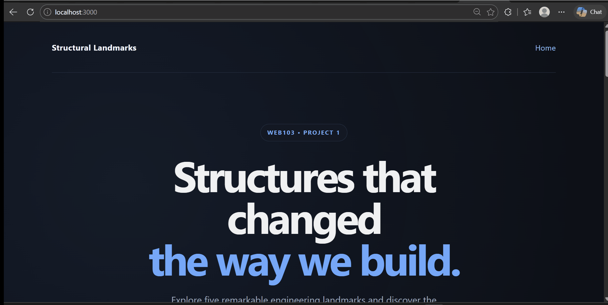

# WEB103 Project 1 - Structural Landmarks

Submitted by: **Syed**

About this web app: **Structural Landmarks is an interactive listicle that showcases five remarkable engineering structures from around the world. Users can explore each landmark and learn about its structural type, location, materials, year of completion, dimensions, and engineering significance.**

Time spent: **X** hours

## Required Features

The following **required** functionality is completed:

<!-- Make sure to check off completed functionality below -->
- [x] **The web app uses only HTML, CSS, and JavaScript without a frontend framework**
- [x] **The web app displays a title**
- [x] **The web app displays at least five unique list items, each with at least three displayed attributes (such as title, text, and image)**
- [x] **The user can click on each item in the list to see a detailed view of it, including all data fields**
  - [x] **Each detail view has a unique endpoint, such as `localhost:3000/structures/golden-gate-bridge` and `localhost:3000/structures/burj-khalifa`**
  - [x] *The unique URL for each detailed view is shown in the video walkthrough.*
- [x] **The web app serves an appropriate 404 page when no matching route is defined**
- [x] **The web app is styled using Picocss**

The following **optional** features are implemented:

- [x] The web app displays items as responsive cards rather than a traditional list
- [x] Cards include hover animations and interactive styling

The following **additional** features are implemented:

- [x] Added a responsive layout for desktop and mobile devices
- [x] Added custom illustrations for each engineering landmark
- [x] Added engineering facts including location, year completed, structural type, material, and dimensions
- [x] Added a reusable detail page for individual structures
- [x] Added Express API routes for retrieving all structures and individual structures
- [x] Added a custom 404 error page for invalid routes
- [x] Added a modern engineering-inspired dark interface

## Video Walkthrough

Here's a walkthrough of implemented required features:

GIF created with **ScreenToGif**

<!-- Recommended tools:
[Kap](https://getkap.co/) for macOS
[ScreenToGif](https://www.screentogif.com/) for Windows
[peek](https://github.com/phw/peek) for Linux.
-->

## Notes

One challenge I encountered was understanding how Express routes connect the frontend to the data. I learned how dynamic routes such as `/structures/:slug` can be used to create a unique page for each list item.

I also learned how the frontend can request data from Express API endpoints using JavaScript's `fetch()` function and dynamically display that information on the webpage.

Another challenge was implementing a custom 404 page so that invalid routes are handled properly instead of displaying a generic browser or Express error.

This project helped me better understand the relationship between HTML, CSS, JavaScript, Express, routes, request handlers, and frontend/backend communication.

## License

Copyright 2026 Syed

Licensed under the Apache License, Version 2.0 (the "License"); you may not use this file except in compliance with the License. You may obtain a copy of the License at

> http://www.apache.org/licenses/LICENSE-2.0

Unless required by applicable law or agreed to in writing, software distributed under the License is distributed on an "AS IS" BASIS, WITHOUT WARRANTIES OR CONDITIONS OF ANY KIND, either express or implied. See the License for the specific language governing permissions and limitations under the License.